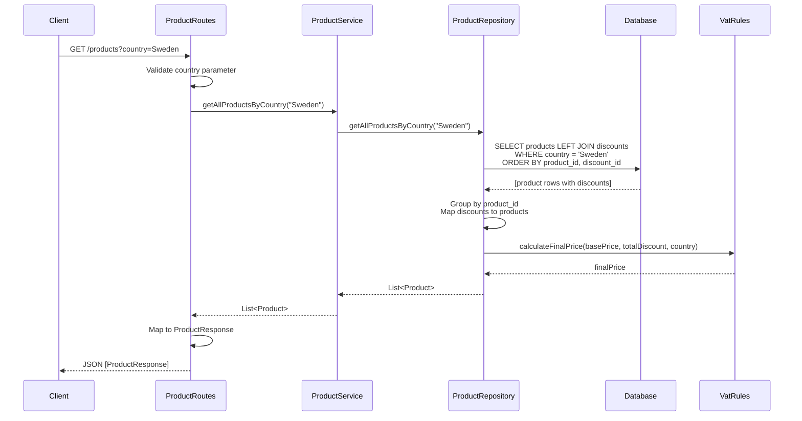
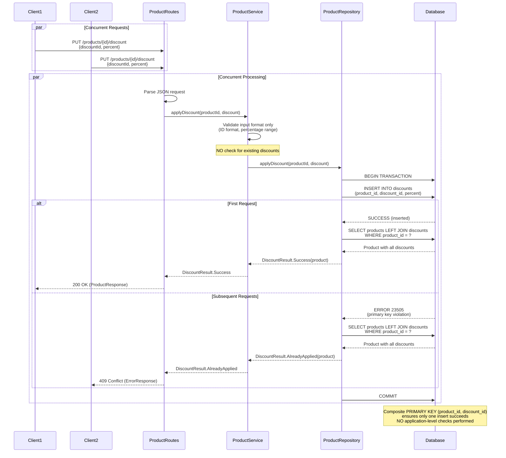

# Architecture Document

## Design Overview

This Product API is built using Ktor framework with a layered architecture pattern:

1. **Presentation Layer** - Routes handle HTTP requests/responses, input validation, and error formatting
2. **Service Layer** - Business logic, orchestration, and validation coordination
3. **Repository Layer** - Data access and database operations
4. **Database Layer** - PostgreSQL with Exposed ORM

## Concurrency Safety Approach

The core requirement is ensuring that "the same discount cannot be applied more than once to the same product — even under heavy concurrent load."

### Solution: Database-Only Enforcement (No Application-Level Checks)

**Concurrency is enforced exclusively at the database level using PostgreSQL transactions and a composite primary key on `(product_id, discount_id)`. The application does not perform any pre-checks and relies on the database to reject concurrent duplicate inserts.**

This ensures correctness under concurrent load without application-level synchronization mechanisms.

### Key Principles

1. **No Pre-Checks**: The application does NOT read existing discounts before inserting
2. **No Application-Level Validation**: We do NOT check if a discount is "already applied" in code
3. **Database Authority**: PostgreSQL's composite primary key is the single source of truth
4. **Atomic Operations**: Each INSERT attempt is atomic - either it succeeds or fails at the database level

### Why This Approach?

The requirements explicitly state:
> "In-memory solutions (e.g. ConcurrentHashMap) are not allowed. Concurrency must be enforced at the database level."

This means:
- **NOT allowed**: Checking `existingProduct.discounts` before inserting
- **NOT allowed**: Application-level validation of "already applied"
- **Required**: Database constraint handles all concurrency concerns
- **Required**: Application is "dumb" - just attempts INSERT and handles the result

### Implementation Details

```kotlin
object DiscountsTable : Table("discounts") {
    val productId: Column<String> = varchar("product_id", 255)
        .references(ProductsTable.id, onDelete = ForeignKeyConstraint.Cascade)
    val discountId: Column<String> = varchar("discount_id", 255)
    val percent: Column<Double> = double("percent")
    
    /**
     * Composite primary key ensures database-level uniqueness.
     * Only one insert can succeed for a given (product_id, discount_id) combination.
     */
    override val primaryKey = PrimaryKey(productId, discountId)
}
```

The `applyDiscount` method:
1. **Directly attempts INSERT** - no pre-checks
2. **Catches PostgreSQL error 23505** (unique constraint violation)
3. **Interprets constraint violation as "already applied"**
4. **Returns appropriate result** based on database response

```kotlin
fun applyDiscount(productId: String, discount: Discount): DiscountResult = transaction {
    try {
        // Attempt INSERT - database enforces uniqueness
        DiscountsTable.insert { ... }
        DiscountResult.Success(getProductById(productId))
    } catch (e: PSQLException) {
        when (e.sqlState) {
            "23505" -> DiscountResult.AlreadyApplied(...)  // Primary key violation
            "23503" -> DiscountResult.ProductNotFound(...) // Foreign key violation
            else -> DiscountResult.DatabaseError(...)
        }
    }
}
```

### Benefits

- **True Concurrency Safety**: Database transactions and constraints handle all race conditions
- **ACID Compliance**: PostgreSQL guarantees atomicity and consistency
- **Distributed System Ready**: Works across multiple application instances
- **No Application Complexity**: Simple code - just INSERT and handle exceptions
- **Performance**: No unnecessary reads before writes

## Final Price Calculation

The final price is calculated using:

```
finalPrice = basePrice × (1 - totalDiscount% / 100) × (1 + VAT%)
```

Where:
- `totalDiscount%` = sum of all discount percentages applied to the product
- `VAT%` = country-specific VAT rate (Sweden: 25%, Germany: 19%, France: 20%)

This calculation is done in the `Product.finalPrice` property, computed dynamically based on the current discount list.

## Database Schema

### Products Table
- `id` (String, Primary Key) - Unique product identifier
- `name` (String) - Product name
- `base_price` (Double) - Price before tax and discount
- `country` (String) - Country name

### Discounts Table
- `product_id` (String, Foreign Key) - References products.id
- `discount_id` (String) - Unique discount identifier (idempotency key)
- `percent` (Double) - Discount percentage (0-100, exclusive)

**Unique Constraint**: `(product_id, discount_id)` - ensures no duplicate discounts per product

## API Flow Diagrams

### GET /products?country={country}



### PUT /products/{id}/discount



## Error Handling

The application uses a consistent error handling strategy:

### HTTP Status Codes

| Status Code | Scenario | Response Body |
|-------------|----------|---------------|
| 200 OK | Successful discount application | `ProductResponse` |
| 400 Bad Request | Invalid input (missing country, invalid discount format, validation errors) | `ErrorResponse` |
| 404 Not Found | Product doesn't exist | `ErrorResponse` |
| 409 Conflict | Discount already applied (idempotent) | `ErrorResponse` |
| 503 Service Unavailable | Database connection errors | `ErrorResponse` |
| 500 Internal Server Error | Unexpected errors | `ErrorResponse` |

### Error Response Format

```json
{
  "error": "Error type",
  "details": "Detailed error message"
}
```

### Error Handling Flow

1. **Routes Layer**: Validates HTTP-level concerns (missing parameters, malformed JSON)
2. **Service Layer**: Validates business rules and coordinates operations
3. **Repository Layer**: Handles database operations and constraint violations
4. **Exception Handling**: All exceptions are caught and converted to appropriate HTTP responses

### Specific Error Scenarios

- **Missing country parameter**: Returns 400 Bad Request with supported countries list
- **Unsupported country**: Returns 400 Bad Request with supported countries list
- **Product not found**: Returns 404 Not Found
- **Invalid discount ID format**: Returns 400 Bad Request (must be alphanumeric, hyphens, underscores only)
- **Invalid discount percentage**: Returns 400 Bad Request (must be > 0 and <= 100)
- **Total discount > 100%**: Returns 400 Bad Request (business rule violation)
- **Maximum discounts exceeded**: Returns 400 Bad Request (max 20 discounts per product)
- **Duplicate discount**: Returns 409 Conflict with current product state (idempotent behavior)
- **Database errors**: Returns 503 Service Unavailable or 500 Internal Server Error

## Testing Strategy

The `HttpConcurrencyTest` demonstrates concurrency safety by:
1. Creating a test product
2. Launching 50 concurrent HTTP requests to apply the same discount
3. Verifying that the discount exists exactly once in the database
4. Confirming final price calculation is correct

This test proves that the database-level constraint successfully prevents duplicate discount applications.

## Code Quality Improvements

### Architecture Enhancements

1. **Service Layer**: Introduced a dedicated service layer to separate business logic from routes and repository
   - Routes handle HTTP concerns (request/response, status codes)
   - Service handles business logic and validation coordination
   - Repository handles data access only

2. **Transaction Management**: Fixed nested transaction issues
   - Removed nested `getProductById` calls within `applyDiscount` transaction
   - Uses local helper functions within transaction scope
   - Optimized queries to reduce database round trips

3. **Dependency Injection**: Improved dependency management
   - Removed global repository instance
   - Service and repository instances created at appropriate scopes
   - Better testability and maintainability

4. **Logging**: Added comprehensive logging throughout
   - Structured logging with SLF4J
   - Log levels: INFO for operations, WARN for validation failures, ERROR for exceptions
   - Helps with debugging and monitoring

5. **Error Handling**: Consistent error handling strategy
   - Proper exception handling at each layer
   - Clear error messages for clients
   - Appropriate HTTP status codes

6. **Query Optimization**: Improved database query efficiency
   - Reduced number of queries in `applyDiscount`
   - Efficient product existence checks

## Scalability Considerations

- **Connection Pooling**: HikariCP manages database connections efficiently (max 10, min 2)
- **Transaction Isolation**: PostgreSQL's default isolation level (READ COMMITTED) is sufficient for this use case
- **Unique Index**: The unique constraint creates an index, ensuring fast lookups and constraint checks
- **Stateless API**: No server-side session state, making horizontal scaling straightforward
- **Single Query Pattern**: Products and discounts loaded in one query, reducing database load

## Future Improvements

1. **Caching**: Add Redis for frequently accessed products
2. **Validation**: Add more robust input validation and error messages
3. **Logging**: Add structured logging for monitoring and debugging
4. **Metrics**: Add Prometheus metrics for monitoring discount application rates
5. **API Versioning**: Support multiple API versions
6. **Pagination**: Add pagination for GET /products endpoint