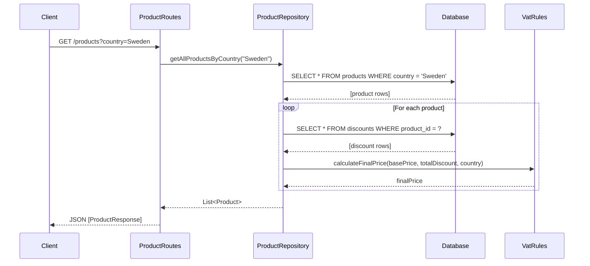
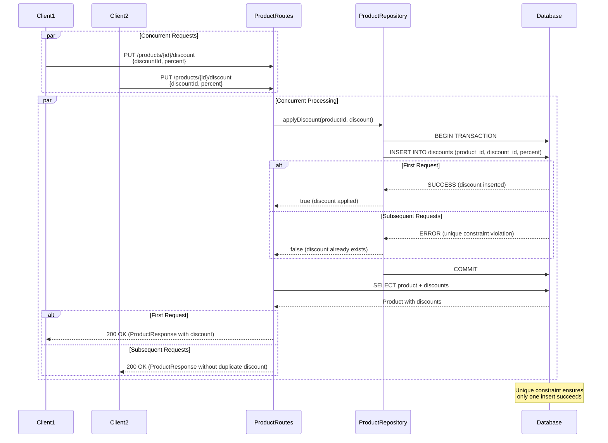

# Architecture Document

## Design Overview

This Product API is built using Ktor framework with a layered architecture pattern:

1. **Presentation Layer** - Routes handle HTTP requests/responses
2. **Service/Repository Layer** - Business logic and data access
3. **Database Layer** - PostgreSQL with Exposed ORM

## Concurrency Safety Approach

The core requirement is ensuring that "the same discount cannot be applied more than once to the same product — even under heavy concurrent load."

### Solution: Database-Level Unique Constraint

We use a **database unique constraint** on the combination of `(product_id, discount_id)` in the `discounts` table. This ensures:

1. **Atomicity**: The database guarantees that only one insert can succeed for a given (product_id, discount_id) combination
2. **No Race Conditions**: Even if 50+ concurrent requests try to apply the same discount, only the first insert will succeed
3. **Idempotency**: Subsequent attempts return the existing state without errors
4. **True Concurrency Safety**: This is enforced at the database level, not application level

### Why Not In-Memory Solutions?

The requirements explicitly state:
> "In-memory solutions (e.g. ConcurrentHashMap) are not allowed. Concurrency must be enforced at the database level."

Our approach uses PostgreSQL's unique constraint enforcement, which is:
- Thread-safe by nature
- ACID compliant
- Persistent across server restarts
- Handles distributed systems scenarios

### Implementation Details

```kotlin
object DiscountsTable : Table("discounts") {
    val productId: Column<String> = varchar("product_id", 255)
    val discountId: Column<String> = varchar("discount_id", 255)
    
    init {
        uniqueIndex(productId, discountId)  // Enforces uniqueness
    }
}
```

The `applyDiscount` method catches database constraint violations and interprets them as "discount already exists", returning false to indicate idempotent behavior.

## Final Price Calculation

The final price is calculated using:

```
finalPrice = basePrice × (1 - totalDiscount% / 100) × (1 + VAT%)
```

Where:
- `totalDiscount%` = sum of all discount percentages applied to the product
- `VAT%` = country-specific VAT rate (Sweden: 25%, Germany: 19%, France: 20%)

This calculation is done in the `Product.finalPrice` property, computed dynamically based on the current discount list.

## Database Schema

### Products Table
- `id` (String, Primary Key) - Unique product identifier
- `name` (String) - Product name
- `base_price` (Double) - Price before tax and discount
- `country` (String) - Country name

### Discounts Table
- `product_id` (String, Foreign Key) - References products.id
- `discount_id` (String) - Unique discount identifier (idempotency key)
- `percent` (Double) - Discount percentage (0-100, exclusive)

**Unique Constraint**: `(product_id, discount_id)` - ensures no duplicate discounts per product

## API Flow Diagrams

### GET /products?country={country}



### PUT /products/{id}/discount



## Error Handling

- **Missing country parameter**: Returns 400 Bad Request
- **Product not found**: Returns 404 or throws IllegalArgumentException
- **Invalid discount percentage**: Validation in Discount model (must be 0-100, exclusive)
- **Duplicate discount**: Silently ignored (idempotent behavior), returns current product state

## Testing Strategy

The `HttpConcurrencyTest` demonstrates concurrency safety by:
1. Creating a test product
2. Launching 50 concurrent HTTP requests to apply the same discount
3. Verifying that the discount exists exactly once in the database
4. Confirming final price calculation is correct

This test proves that the database-level constraint successfully prevents duplicate discount applications.

## Scalability Considerations

- **Connection Pooling**: HikariCP manages database connections efficiently
- **Transaction Isolation**: PostgreSQL's default isolation level (READ COMMITTED) is sufficient for this use case
- **Unique Index**: The unique constraint creates an index, ensuring fast lookups and constraint checks
- **Stateless API**: No server-side session state, making horizontal scaling straightforward

## Future Improvements

1. **Caching**: Add Redis for frequently accessed products
2. **Validation**: Add more robust input validation and error messages
3. **Logging**: Add structured logging for monitoring and debugging
4. **Metrics**: Add Prometheus metrics for monitoring discount application rates
5. **API Versioning**: Support multiple API versions
6. **Pagination**: Add pagination for GET /products endpoint