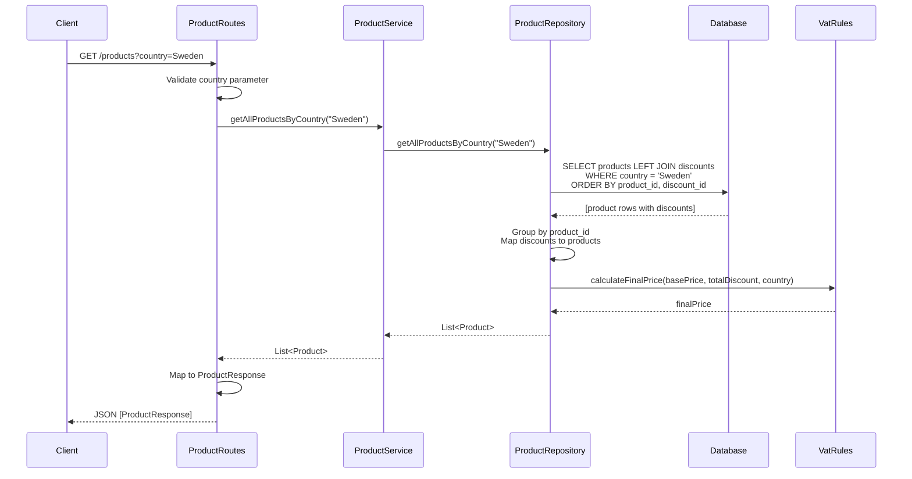
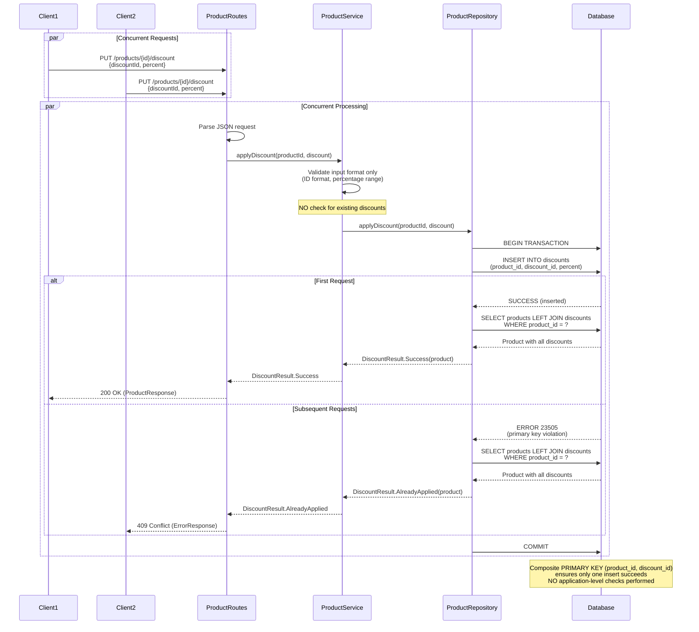

# Architecture

## Overview

The API is built with Ktor and follows a simple layered structure:

- Routes handle HTTP requests and responses
- Service layer contains the business logic
- Repository handles all database operations
- PostgreSQL stores the data, using Exposed as the ORM

## How Concurrency Works

The main requirement was making sure the same discount can't be applied twice to a product, even when lots of requests come in at the same time.

The solution is simple: we don't check anything in the application code. We just try to insert the discount and let PostgreSQL handle it. The database has a composite primary key on `(product_id, discount_id)` that prevents duplicates.

When multiple requests try to insert the same discount, PostgreSQL ensures only one succeeds. The others get a constraint violation error. This way we don't need any locks or application-level synchronization.

### What We Don't Do

- We don't read existing discounts before inserting
- We don't check if a discount is already applied in the application code
- We don't use any application-level locks or synchronization

### What We Do Instead

- Just attempt the INSERT directly
- Let PostgreSQL's primary key constraint handle duplicates
- Catch the database error if it already exists
- Return the appropriate response based on what the database tells us

### Why This Approach?

The requirements were clear: concurrency must be enforced at the database level, not in application code. So instead of trying to be smart and check things first, the application just tries to insert and handles whatever the database says.

This is actually simpler and more reliable - the database is the single source of truth, and we don't have to worry about race conditions between checking and inserting.

### Implementation Details

```kotlin
object DiscountsTable : Table("discounts") {
    val productId: Column<String> = varchar("product_id", 255)
        .references(ProductsTable.id, onDelete = ForeignKeyConstraint.Cascade)
    val discountId: Column<String> = varchar("discount_id", 255)
    val percent: Column<Double> = double("percent")
    
    /**
     * Composite primary key ensures database-level uniqueness.
     * Only one insert can succeed for a given (product_id, discount_id) combination.
     */
    override val primaryKey = PrimaryKey(productId, discountId)
}
```

The `applyDiscount` method:
1. **Directly attempts INSERT** - no pre-checks
2. **Catches PostgreSQL error 23505** (unique constraint violation)
3. **Interprets constraint violation as "already applied"**
4. **Returns appropriate result** based on database response

```kotlin
fun applyDiscount(productId: String, discount: Discount): DiscountResult = transaction {
    try {
        // Attempt INSERT - database enforces uniqueness
        DiscountsTable.insert { ... }
        DiscountResult.Success(getProductById(productId))
    } catch (e: PSQLException) {
        when (e.sqlState) {
            "23505" -> DiscountResult.AlreadyApplied(...)  // Primary key violation
            "23503" -> DiscountResult.ProductNotFound(...) // Foreign key violation
            else -> DiscountResult.DatabaseError(...)
        }
    }
}
```

### Why This Works

PostgreSQL's transactions and primary key constraint handle all the race conditions for us. Since we're not doing any pre-checks, there's no window where two requests could both think a discount doesn't exist and both try to insert it.

This also means it works fine if we have multiple instances of the application running - they all hit the same database constraint, so there's no coordination needed between instances.

The code is simpler too - just try to insert, catch the exception if it fails, and return the right response.

## Price Calculation

Final price = base price × (1 - total discount%) × (1 + VAT%)

The total discount is just the sum of all discount percentages on the product. VAT rates are 25% for Sweden, 19% for Germany, and 20% for France.

This is calculated in the `Product.finalPrice` property whenever we access it, so it's always up to date with the current discounts.

## Database Schema

**Products table:**
- `id` - product identifier (primary key)
- `name` - product name
- `base_price` - price before discounts and VAT
- `country` - country name

**Discounts table:**
- `product_id` - references products.id
- `discount_id` - the discount identifier
- `percent` - discount percentage

The composite primary key on `(product_id, discount_id)` is what prevents duplicate discounts. This is enforced at the database level, so even concurrent requests can't create duplicates.

## API Flow Diagrams

### GET /products?country={country}



### PUT /products/{id}/discount



## Error Handling

When things go wrong, we return appropriate HTTP status codes:

### HTTP Status Codes

| Status Code | Scenario | Response Body |
|-------------|----------|---------------|
| 200 OK | Successful discount application | `ProductResponse` |
| 400 Bad Request | Invalid input (missing country, invalid discount format, validation errors) | `ErrorResponse` |
| 404 Not Found | Product doesn't exist | `ErrorResponse` |
| 409 Conflict | Discount already applied (idempotent) | `ErrorResponse` |
| 503 Service Unavailable | Database connection errors | `ErrorResponse` |
| 500 Internal Server Error | Unexpected errors | `ErrorResponse` |

### Error Response Format

```json
{
  "error": "Error type",
  "details": "Detailed error message"
}
```

Errors are handled at each layer - routes check for missing parameters or bad JSON, service validates business rules, and repository catches database constraint violations. Everything gets converted to appropriate HTTP responses.

### Specific Error Scenarios

- **Missing country parameter**: Returns 400 Bad Request with supported countries list
- **Unsupported country**: Returns 400 Bad Request with supported countries list
- **Product not found**: Returns 404 Not Found
- **Invalid discount ID format**: Returns 400 Bad Request (must be alphanumeric, hyphens, underscores only)
- **Invalid discount percentage**: Returns 400 Bad Request (must be > 0 and <= 100)
- **Total discount > 100%**: Returns 400 Bad Request (business rule violation)
- **Maximum discounts exceeded**: Returns 400 Bad Request (max 20 discounts per product)
- **Duplicate discount**: Returns 409 Conflict with current product state (idempotent behavior)
- **Database errors**: Returns 503 Service Unavailable or 500 Internal Server Error

## Testing

The concurrency test creates a product, fires off 50 simultaneous requests to apply the same discount, and then checks that only one discount ended up in the database. This proves the database constraint is working correctly under load.

## Implementation Notes

The code is split into routes, service, and repository layers to keep things organized. Transactions are handled properly - we avoid nested transaction calls and keep queries efficient.

Logging is added throughout so we can see what's happening when things run. Errors are handled consistently at each layer and converted to appropriate HTTP responses.

## Performance Notes

The app uses HikariCP for connection pooling (max 10 connections). PostgreSQL's default transaction isolation level (READ COMMITTED) works fine here since we're relying on the primary key constraint for correctness, not isolation level tricks.

The API is stateless, so we can run multiple instances if needed - they'll all hit the same database. Products and discounts are loaded together in a single query to avoid multiple round trips.

## Possible Improvements

If this were going to production, things like caching (Redis), better monitoring (Prometheus metrics), API versioning, and pagination for the products endpoint would be worth considering. 